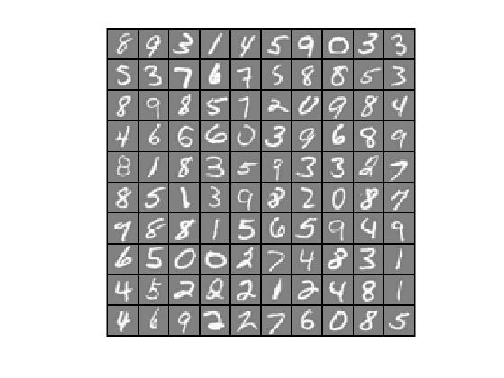

# Machine Learning (MATLAB) - Multi-class Classification and Neural Network

Machine Learning course from Stanford University on [Coursera](https://www.coursera.org/learn/machine-learning).

### Environment
- macOS Catalina (version 10.15.3)
- MATLAB 2018 b

### Dataset
- ex3data1.mat
- ex3weights.mat

### Files included in this repo
- ex3.m - Octave/MATLAB script that steps through part 1
- ex3_nn.m - Octave/MATLAB script that steps through part 2
- ex3data1.mat - Training set of hand-written digits
- ex3weights.mat - Initial weights for the neural network exercise
- submit.m - Submission script that sends our solutions to servers
- displayData.m - Function to help visualize the dataset
- fmincg.m - Function minimization routine (similar to fminunc)
- sigmoid.m - Sigmoid function

[⋆] lrCostFunction.m - Logistic regression cost function

[⋆] oneVsAll.m - Train a one-vs-all multi-class classifier

[⋆] predictOneVsAll.m - Predict using a one-vs-all multi-class classifier

[⋆] predict.m - Neural network prediction function

## Part 1: Multi-class Classification

For this part, we will use logistic regression and neural networks to recognize handwritten digits (from 0 to 9).

Automated handwritten digit recognition is widely used today - from recognizing zip codes (postal codes) on mail envelopes to recognizing amounts written on bank checks.

In the first part, we will extend your previous implemention of logistic regression and apply it to one-vs-all classification.

For this portion we will use following MATLAB script
```
ex3.m
```

### Part 1.1: Dataset

Given dataset *ex3data1.mat* contains 5000 training examples of handwritten digits, where each training example is a 20 pixel by 20 pixel grayscale image of the digit. Each pixel is represented by a floating point number indicating the grayscale intensity at that location. The 20 by 20 grid of pixels is “unrolled” into a 400-dimensional vector. 

Each of these training examples becomes a single row in our data matrix X. This gives us a 5000 by 400 matrix X where every row is a training example for a handwritten digit image.

The second part of the training set is a 5000-dimensional vector y that contains labels for the training set. To make things more compatible with Octave/MATLAB indexing, where there is no zero index, we have mapped the digit zero to the value ten. Therefore, a “0” digit is labeled as “10”, while the digits “1” to “9” are labeled as “1” to “9” in their natural order.

```
% Load saved matrices from file
load('ex3data1.mat');
% The matrices X and y will now be in Octave environment
```

### Part 1.2: Visualizing the data
#### displayData.m - Function to help visualize the dataset

In ex3.m, the code randomly selects selects 100 rows from X and passes those rows to the displayData function. This function maps each row to a 20 pixel by 20 pixel grayscale image and displays the images together. 


- Figure: Dataset

### Part 1.3: Vectorizing Logistic Regression

We will be using multiple *one-vs-all logistic regression* models to build a multi-class classifier. Since there are 10 classes, you will need to train 10 separate logistic regression classifiers. To make this training efficient, it is important to ensure that our code is well vectorized.

In this section, we will implement a vectorized version of logistic regression that does not employ any *for* loops.

#### Vectorizing the cost function
We will begin by writing a vectorized version of the cost function. 

Cost Function in Unregularized logistic regresssion


We will write the unregularized cost function in the file *lrcostFunction.m*. We should also use a vectorized approach for the rest of the cost function. A fully vectorized version of lrCostFunction.m should not contain any loops.

##### lrCostFunction.m - Logistic regression cost function
```
h = sigmoid(X * theta);
J = (1/m) * sum((-y)' * log(h)-(1-y)' * log(1-h));
```

#### Vectorizing the gradient
Gradient of the unregularized logistic regression cost: 


```
grad = (1/m * X' * (h - y));
```

#### Vectorizing regularized logistic regression
The cost function in Regularized logistic regression: 


NOTE: We should not be regularizing *θ_0* which is used for the bias term.

```
function [J, grad] = lrCostFunction(theta, X, y, lambda)

% Initialize some useful values
m = length(y); % number of training examples

h = sigmoid(X * theta);

% unregularized logistic regression
% J = (1/m) * sum((-y)' * log(h)-(1-y)' * log(1-h)) 

% regularized logistic regression
J = (1/m) * sum((-y)' * log(h)-(1-y)' * log(1-h)) + (lambda/(2 * m)) * sum(theta(2:end).^2);

% regularized gradient for logistic regression
grad = (1/m * X' * (h - y)) + [0; lambda/m * theta(2:end)];

end
```

##### Result
Regularized Logistic Regression:   
Expected cost:  *2.534819*  
Expected gradients: *0.146561*,  *-0.548558*, *0.724722*,  *1.398003*  

### Part 1.4: One-vs-all Classification
In this part, we will implement one-vs-all classification by training multiple regularized logistic regression classifiers, one for each of the K classes in our dataset. In the handwritten digits dataset, K = 10, but the code should work for any value of K.

Furthermore, we will be using *fmincg* for this part (instead of *fminunc*). *fmincg* works similarly to *fminunc*, but is more more efficient for dealing with a large number of parameters.

##### oneVsAll.m - Train a one-vs-all multi-class classifier
```
initial_theta = zeros(n + 1, 1);

options = optimset('GradObj', 'on', 'MaxIter', 50);

for(i = 1:num_labels)
    all_theta(i,:) = fmincg (@(t)(lrCostFunction(t, X, (y == i), lambda)), initial_theta, options);
end;
```

#### One-vs-all Prediction
We should compute the “probability” that it belongs to each class using the trained logistic regression classifiers.

*one-vs-all* prediction function will pick the class for which the corresponding logistic regression classifier outputs the highest probability and return the class label (1, 2,..., or K) as the prediction for the input example.

redictOneVsAll.m to use the one-vs-all classifier to make predictions.

##### predictOneVsAll.m - Predict using a one-vs-all multi-class classifier
```
h = sigmoid(X * all_theta');

for(i = 1:m)
    [dummy, p(i)] = max(h(i,:));
end;
```

The training set accuracy is about 94.9% (i.e., it classifies 94.9% of the examples in the training set correctly).


## Part 2: Neural Networks
In previous part, we implemented multi-class logistic regression to recognize handwritten digits. However, logistic regression cannot form more complex hypotheses as it is only a linear classifier.

In this part, we will implement a neural network to recognize handwritten digits using the same training set as before. The neural network will be able to represent complex models that form non-linear hypotheses. 

We will be using parameters from a neural network that we have already trained. Our goal is to implement the *feedforward propagation algorithm* to use our weights for prediction.

(Next time we will write the *backpropagation algorithm* for learning the neural network parameters.)

### Part 2.1: Model representation
Our neural network has 3 layers – an input layer, a hidden layer and an output layer. Recall that our inputs are pixel values of digit images. Since the images are of size 20×20, this gives us 400 input layer units (excluding the extra bias unit which always outputs +1). As before, the training data will be loaded into the variables X and y.

For this portion we will use following MATLAB script
```
ex3_nn.m
```

### Part 2.2: Feedforward Propagation and Prediction
Now you will implement *feedforward propagation* for the neural network. We will need to complete the code in predict.m to return the neural network’s prediction.

##### predict.m - Neural network prediction function
```
X = [ones(m,1) X];
h2 = sigmoid(Theta1*X'); % Output of hidden layer, a size(Theta1, 1) x m matrix
h2 = [ones(m,1) h2'];
h = sigmoid(Theta2 * h2');
[dummy, p] = max(h', [ ], 2);
```

The training set accuracy is about 97.52%.

## Result 

Initial dataset:


- Figure: Dataset

### Correct Prediction
Neural Network Prediction: 0 (digit 0)  
 

Neural Network Prediction: 1 (digit 1)  


Neural Network Prediction: 2 (digit 2)  
 

 

Neural Network Prediction: 3 (digit 3)  


Neural Network Prediction: 4 (digit 4)  


Neural Network Prediction: 5 (digit 5)  


Neural Network Prediction: 6 (digit 6)  


Neural Network Prediction: 7 (digit 7)  
 

Neural Network Prediction: 8 (digit 8)  


Neural Network Prediction: 9 (digit 9)  
 

### Wrong Prediction
Neural Network Prediction: 6 (digit 6)  


## Course Links

1) Machine Learning by Stanford University on [Coursera](https://www.coursera.org/learn/machine-learning)

2) [Neural Network](https://www.coursera.org/learn/machine-learning/home/week/4) 
(Please notice that you need to log in to see the programming assignment.)